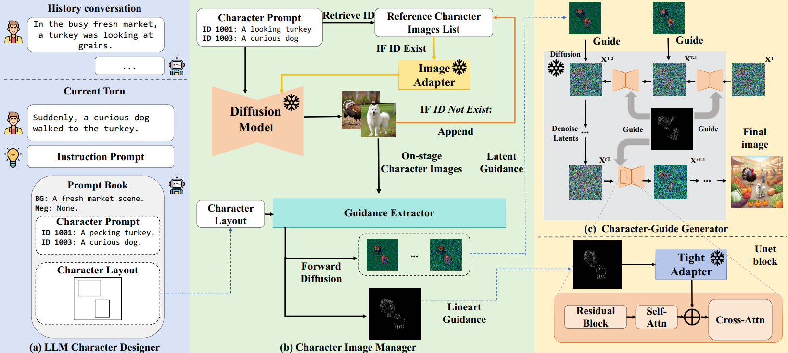

<p align="center">
  

</p>

<!-- ## <div align="center"><b>ConsistentID</b></div> -->

<div align="center">
  
## Theatergen: Character Management with LLM for Consistent Multi-turn Image
[📄[Paper](https://howe140.github.io/theatergen.io/)] &emsp; [🚩[Project Page](https://howe140.github.io/theatergen.io/)] <br>


</div>


## Model Architecture



## Introduction
We propose Theatergen, a tuning-free method for multi-turn consistent image generation. The key idea is to utilize LLM for character management with `layout` and `id`. We further propose the `CMIGBench` for evaluating the consistency in multi-turn image generation.

## TODO
- [ ] Deployment with GPT interface  
- [x] Release Benchmark  
- [x] Release code  

## :fire: News
* **[2024.04.26]** We have released our code and benchmark


## 🔧 Requirements

To install requirements:

```setup
pip install -r requirements.txt
```

## 🧪 Generate
Generate demo with CMIGBenchmark or replace with your own 

```setup
python generate.py --task story --sd_version '1.5' --dataset_path CMIGBench
```
