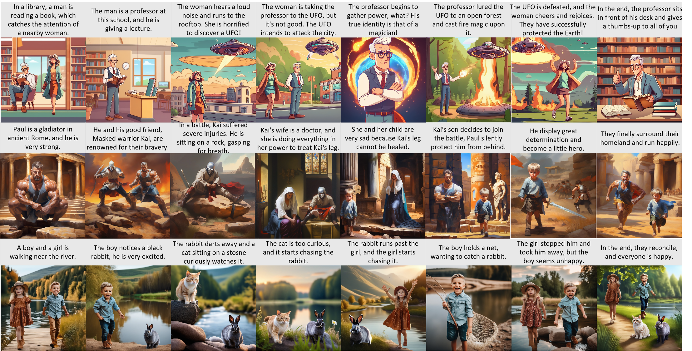

<p align="center">
  

</p>

<!-- ## <div align="center"><b>ConsistentID</b></div> -->

<div align="center">

## Theatergen: Character Management with LLM for Consistent Multi-turn Image Generation


[📄[Paper](https://arxiv.org/abs/2404.18919)] &emsp; [🚩[Project Page](https://howe140.github.io/theatergen.io/)] <br>



</div>


## Model Architecture


## Introduction
We propose Theatergen, a tuning-free method for consistent multi-turn image generation. The key idea is to utilize LLM for character management with `layout` and `id` and customize each `character` to avoid attention leakage. We further propose the `CMIGBench` for evaluating the consistency in multi-turn image generation.

## TODO
- [ ] Deployment with GPT interface  
- [x] Release Benchmark  
- [x] Release code  

## :fire: News
* **[2024.04.26]** We have released our code and benchmark


## Setup
### 🔧 Requirements

To install requirements:

```
pip install -r requirements.txt
```

### 🚀 Generate
Generate with `CMIGBench` or replace with your own demo

```
python generate.py --task story --sd_version '1.5' --dataset_path CMIGBench
```

### 🧪 Evaluate
Prepare the output in the following format

    ├── output_dir
    |   ├── dialogue 1
    |      ├── turn1.png 
    |      ├── turn2.png 
    |      ├── turn3.png 
    |      └── turn4.png 
    |   ├── dialogue 2
    |      ...

Evalutate the generated results of `CMIGBench` 

```
python CMIGBench/eval/eval.py 
python CMIGBench/eval/eval_extra.py 
```

## 👀 Contact Us
If you have any questions, please feel free to email us at howe4884@outlook.com.

🌟🌟🌟(I am an undergraduate student actively seeking opportunities for a Ph.D. program in 25 fall.)🌟🌟🌟
## 💡Acknowledgement
Our work is based on [stable diffusion](https://github.com/Stability-AI/StableDiffusion), [Grounded-SAM](https://github.com/IDEA-Research/Grounded-Segment-Anything), [T2I-Adapter](https://github.com/TencentARC/T2I-Adapter), and [IP-Adapter](https://github.com/tencent-ailab/IP-Adapter). We appreciate their outstanding contributions.

## Citation
If you found this code helpful, please consider citing:
~~~
@article{cheng2024theatergen,
  title={TheaterGen: Character Management with LLM for Consistent Multi-turn Image Generation},
  author={Cheng, Junhao and Yin, Baiqiao and Cai, Kaixin and Huang, Minbin and Li, Hanhui and He, Yuxin and Lu, Xi and Li, Yue and Li, Yifei and Cheng, Yuhao and others},
  journal={arXiv preprint arXiv:2404.18919},
  year={2024}
}
~~~


